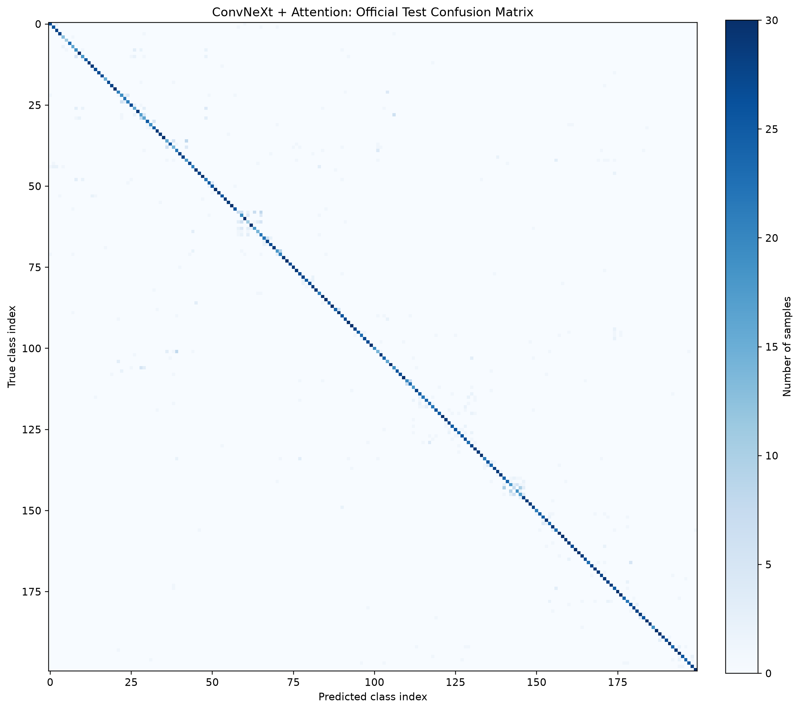
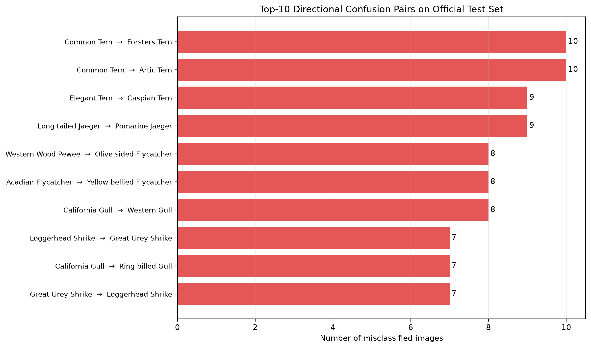
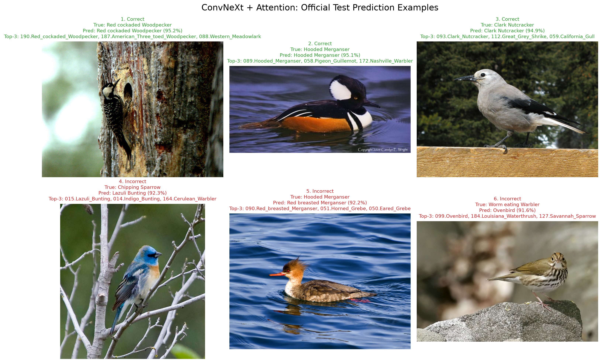
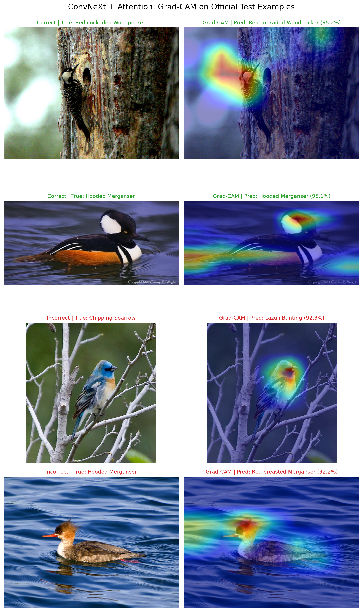

# CUB-200-2011 细粒度鸟类图像分类
## 最终工程实验报告

> 实验日期：2026-08-06  
> 最终模型：**ConvNeXt-Tiny + Attention Pooling**  
> 官方 Test：**Accuracy 87.50% ｜ Macro-F1 87.40% ｜ Top-3 Accuracy 95.48%**

---

## 1. 项目简介

本项目完成 CUB-200-2011 鸟类细粒度图像分类工程。在 200 个类别中，模型需要根据鸟喙、头部、羽毛纹理、翅膀花纹等局部视觉特征识别鸟类种类。

工程覆盖数据准备、固定数据划分、四组模型训练、验证集选模、冻结权重后的官方 Test 评估，以及混淆矩阵、错误案例和 Grad-CAM 可解释性分析。最终目标不仅是取得准确率，也保证实验结果可复现、可审计、可展示。

## 2. 数据集与实验规范

| 项目 | 设置 |
| --- | --- |
| 数据集 | CUB-200-2011 |
| 类别数 | 200 |
| 图像总数 | 11,788 |
| 训练集 | 5,400 |
| 验证集 | 594 |
| 官方 Test 集 | 5,794 |
| 随机种子 | `42` |
| 选模依据 | Validation Accuracy，结合 Macro-F1 |
| 最终评估 | 模型冻结后，仅在官方 Test 集统一执行 |

训练、调参与模型选择均不使用官方 Test 集。Test 指标只在四组模型训练结束并选定 `best_val_raw.pt` 后计算，因此能反映模型的真实泛化性能。

## 3. 工程结构

```text
CUB_200_Classification_v2/
├── configs/                    # 模型训练配置
├── data/                       # 原始数据与固定划分产物
├── src/vision/                 # 数据、模型、训练、评估、可视化模块
├── tests/                      # 工程自检
├── outputs/                    # 各次训练权重、日志和测试输出
├── results/
│   ├── experiment_log.md       # 逐组实验日志
│   └── figures/                # 本报告直接显示的四张最终图
├── evaluate_all_final.py       # 四模型官方 Test 统一评估
├── generate_final_visuals.py   # 最终图表、预测案例、Grad-CAM 生成
└── FINAL_PROJECT_REPORT.md     # 本报告（位于工程根目录）
```

每次训练目录均保留 `resolved_config.yaml`、`history.csv`、`best_val_raw.pt` 与 `final_test_raw/`，分别用于确认实际配置、查看训练过程、恢复最佳权重和审计最终预测结果。

## 4. 对比模型

| 编号 | 模型 | 作用 |
| --- | --- | --- |
| E1 | Custom CNN | 从零训练的基础对照组。 |
| E2 | ResNet-50 | ImageNet 预训练迁移学习基线。 |
| E3 | ConvNeXt-Tiny Baseline | 现代卷积骨干，不使用注意力池化。 |
| E4 | ConvNeXt-Tiny + Attention Pooling | 在 ConvNeXt 特征图上学习空间权重，强化局部细粒度特征。 |

ConvNeXt 系列采用 ImageNet 预训练、AdamW、warm-up + cosine 学习率调度、标签平滑和数据增强。Attention Pooling 进一步让模型将更多权重分配给有辨识度的鸟体区域。

## 5. 验证集选模结果

本节用于说明训练过程和选择 checkpoint 的依据，不能与最终 Test 结果混用。

| 模型 | 训练轮数 | 最终训练 Accuracy | 验证 Accuracy | 验证 Macro-F1 | 最高验证 Accuracy |
| --- | ---: | ---: | ---: | ---: | ---: |
| Custom CNN | 120 | 99.57% | 38.89% | 37.06% | — |
| ResNet-50 | 40 | — | 84.51% | 83.50% | — |
| ConvNeXt-Tiny Baseline | 100 | 99.93% | 86.53% | 85.49% | 87.04%（Epoch 98） |
| ConvNeXt-Tiny + Attention | 120 | 99.89% | 87.71% | 87.13% | 88.05%（Epoch 119） |

Custom CNN 训练准确率接近 100%、验证准确率只有 38.89%，存在明显过拟合。使用 ImageNet 预训练后，ResNet-50 验证性能显著提升；ConvNeXt 和 Attention Pooling 继续带来稳定增益。

## 6. 官方 Test 集最终结果

下表统一使用各实验的最佳验证权重 `best_val_raw.pt`，并在 5,794 张从未参与训练和选模的官方 Test 图片上评估。

| 模型 | Test Accuracy | Macro-F1 | Top-3 Accuracy | 相对上一组 Accuracy 变化 |
| --- | ---: | ---: | ---: | ---: |
| Custom CNN | 36.64% | 36.41% | 55.51% | — |
| ResNet-50 | 84.57% | 84.49% | 93.87% | +47.93 pt |
| ConvNeXt-Tiny Baseline | 86.24% | 86.10% | 93.98% | +1.67 pt |
| **ConvNeXt-Tiny + Attention Pooling** | **87.50%** | **87.40%** | **95.48%** | **+1.26 pt** |

结论如下：

- ImageNet 迁移学习使 ResNet-50 比从零训练的 Custom CNN 高 **47.93 个百分点**。
- ConvNeXt-Tiny 比 ResNet-50 再高 **1.67 个百分点**。
- Attention Pooling 在 ConvNeXt Baseline 基础上提升 **1.26 个百分点**，Top-3 Accuracy 也提升 **1.50 个百分点**。
- 最优模型为 **ConvNeXt-Tiny + Attention Pooling**。

## 7. 最终评估可视化与误差分析

> 本报告与 `results/` 文件夹同级，因此以下图片均使用根目录相对路径 `results/figures/...`。请直接预览本文件，不要预览旧的 `docs/final_project_report.md`。

### 7.1 完整混淆矩阵



主对角线整体明显，说明模型能正确区分大多数类别；错误主要集中在外观接近的鸟类之间。

### 7.2 Top-10 易混淆类别对



该图展示高频的“真实类别 → 预测类别”错误对，说明剩余误差主要来自羽色、体型、姿态或背景相似的视觉近邻类别。

### 7.3 正确与错误预测案例



预测案例同时包含正确样本和高置信度错误样本，并展示真实类别、预测类别、置信度与 Top-3 候选，以便把量化指标与实际模型行为对应起来。

### 7.4 Grad-CAM 注意力热力图



Grad-CAM 用于检查模型的关注位置是否落在鸟头、鸟喙、翅膀和羽毛纹理等有效判别区域，而非主要依赖天空或枝干等背景。

## 8. 结论与后续改进

本项目构建了一个完整、可复现的 CUB-200 细粒度分类工程，并严格隔离验证集选模与官方 Test 最终评估。结果证明：预训练迁移学习是任务性能提升的基础，ConvNeXt-Tiny 优于 ResNet-50，而 Attention Pooling 又带来了可验证的进一步提升。

最终模型位于：

```text
outputs/convnext_attention_v2/20260806_173206/best_val_raw.pt
```

后续可以在不接触 Test 集的前提下，继续在验证集上开展 MixUp、CutMix、类别重采样、更高分辨率或局部特征模块等受控消融实验；若面向部署，可补充单图/批量推理界面、模型大小、显存占用和推理延迟指标。

## 附录：关键文件

- 实验日志：`results/experiment_log.md`
- 四模型最终评估：`evaluate_all_final.py`
- 最终图表重建：`generate_final_visuals.py`
- 最终原始推理结果：`outputs/convnext_attention_v2/20260806_173206/final_test_raw/`
